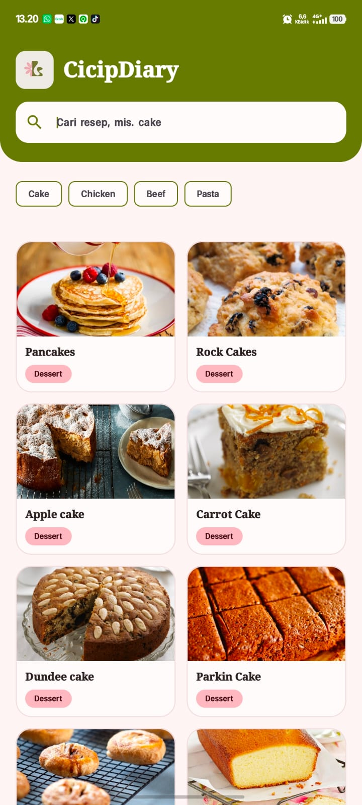
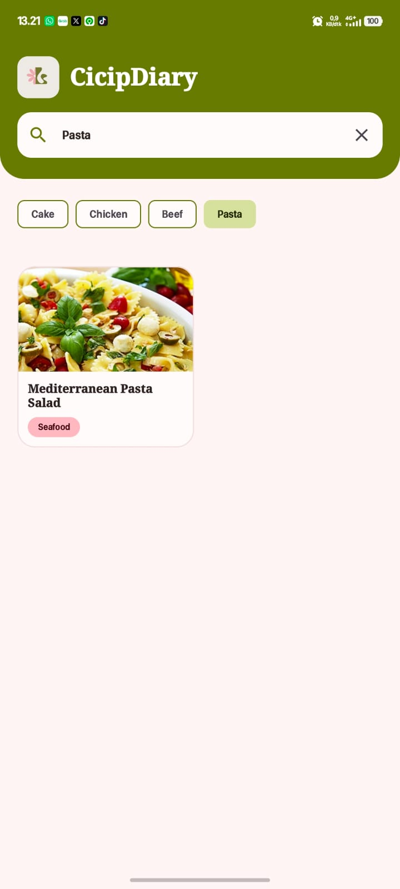
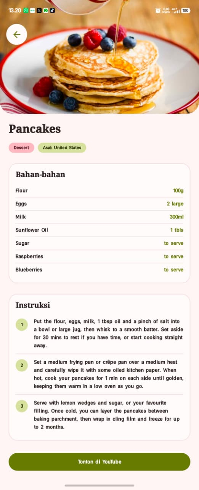

### Nama : Dera Amelia
### NIM   : H1D024002
### SHIFT AWAL : F
### SHIFT AKHIR : E

# RESPONSI PRAKTIKUM MOBILE SHIFT E
# CicipDiary 
CicipDiary adalah aplikasi Android yang dirancang untuk membantu Anda menemukan dan menyimpan resep makanan dari berbagai belahan dunia. Aplikasi ini dibangun dengan teknologi modern dari ekosistem Android untuk memberikan pengalaman pengguna yang cepat, responsif, dan menarik secara visual.

---

##  a. Screenshot Aplikasi

Aplikasi ini mendukung Mode Terang (Light Mode) dan Mode Gelap (Dark Mode). Berikut adalah tampilan antarmuka dari CicipDiary:

### Tampilan Beranda (Home)
| Light Mode | Dark Mode |
| :---: | :---: |
|  |  |

### Tampilan Pencarian (Search)
| Light Mode | Dark Mode |
| :---: | :---: |
|  |  |

### Tampilan Detail Resep (Detail)
| Light Mode | Dark Mode |
| :---: | :---: |
|  |  |

---

## b. Penjelasan Fitur

1. **Jelajah Resep (Home)**
   Menampilkan daftar berbagai resep makanan yang menggugah selera saat aplikasi pertama kali dibuka. Pengguna dapat menelusuri daftar resep dengan mudah melalui antarmuka bergaya kartu (card).
2. **Pencarian Makanan (Search)**
   Pengguna dapat mencari resep atau makanan spesifik berdasarkan nama. Hasil pencarian akan langsung diperbarui secara responsif (real-time typing search) sehingga memudahkan penemuan hidangan favorit.
3. **Detail Resep Makanan (Detail)**
   Saat sebuah makanan dipilih, pengguna akan diarahkan ke halaman detail yang menyajikan:
   - Gambar makanan resolusi tinggi
   - Nama dan kategori hidangan
   - Asal/Area dari makanan tersebut
   - Instruksi langkah demi langkah cara memasak
   - (Jika tersedia) Bahan-bahan yang diperlukan
   - Link  Youtube jika tersedia
4. **Dukungan Dark Mode & Light Mode**
   Aplikasi secara otomatis menyesuaikan tampilan terang atau gelap berdasarkan preferensi tema perangkat sistem pengguna (System UI).

---

## c. Penjelasan Architecture

Aplikasi CicipDiary mengadopsi arsitektur **MVVM (Model-View-ViewModel)** yang direkomendasikan oleh Google untuk pengembangan aplikasi Android modern:

1. **View Layer (UI):** Dibangun menggunakan **Jetpack Compose**. Layer ini murni reaktif dan hanya bertugas untuk me-render UI berdasarkan *state* yang diberikan oleh ViewModel.
2. **ViewModel Layer:** Bertindak sebagai penghubung antara View dan Data Layer. ViewModel menyimpan UI State (menggunakan `StateFlow`) dan menangani *business logic* sederhana, serta memastikan data tetap bertahan saat konfigurasi perangkat berubah (seperti rotasi layar).
3. **Model / Data Layer:** Terdiri dari *Repository* dan *Remote Data Source*. Layer ini bertugas mengambil data dari internet (API) menggunakan Retrofit dan mendistribusikan hasilnya (baik berhasil maupun error) kembali ke ViewModel.

Dengan arsitektur MVVM, kode menjadi lebih modular, mudah diuji (testable), dan terhindar dari *callback hell* di UI.

---

## d. Penjelasan API yang Digunakan

Aplikasi ini menggunakan public API gratis dari **[TheMealDB](https://www.themealdb.com/api.php)**. 

URL Dasar (Base URL): `https://www.themealdb.com/api/json/v1/1/`

Endpoint yang digunakan dalam CicipDiary:
1. **Search Meal by Name**
   - **Endpoint:** `search.php?s={query}`
   - **Fungsi:** Digunakan di halaman Home (menampilkan data awal) dan halaman Pencarian. Mengembalikan array berisi objek makanan yang cocok dengan keyword pencarian.
2. **Lookup Full Meal Details by ID**
   - **Endpoint:** `lookup.php?i={id}`
   - **Fungsi:** Digunakan di halaman Detail. Berdasarkan ID makanan yang dipilih pengguna, API ini mengembalikan data lengkap makanan tersebut termasuk bahan-bahan, takaran, dan instruksi memasak.

---

## e. Penjelasan Teknis Implementasi

Aplikasi ini diimplementasikan dengan stack Android modern (Modern Android Development / MAD):

- **Bahasa Pemrograman:** **Kotlin**, menggunakan fitur modern seperti *Coroutines* untuk pemrosesan asynchronous agar aplikasi tidak *freeze* saat mengambil data dari internet.
- **UI Toolkit:** **Jetpack Compose**. Seluruh antarmuka (termasuk animasi, list, dan state) ditulis secara deklaratif (Declarative UI), menggantikan XML konvensional.
- **Navigasi:** Menggunakan **Jetpack Navigation Compose**. Perpindahan antar layar (Home -> Detail) dikelola melalui *NavGraph* yang *type-safe* dan berbasis Compose.
- **Networking:** Menggunakan **Retrofit2** yang dikombinasikan dengan **OkHttp Logging Interceptor**. JSON response dari server diparsing secara otomatis menjadi Kotlin Data Class menggunakan **Gson Converter**.
- **Image Loading:** Memuat gambar makanan dari URL secara asynchronous menggunakan **Coil (Coroutine Image Loader) for Compose**. Coil sangat ringan dan dioptimalkan untuk Jetpack Compose.
- **State Management:** Menggunakan representasi *UiState* di dalam ViewModel, yang diekspos sebagai `StateFlow` dan dikonsumsi oleh Compose menggunakan `collectAsState()`.

Dengan *tech-stack* ini, CicipDiary tidak hanya ringan dan cepat, namun juga *maintainable* dan siap jika ingin dikembangkan lebih jauh.
